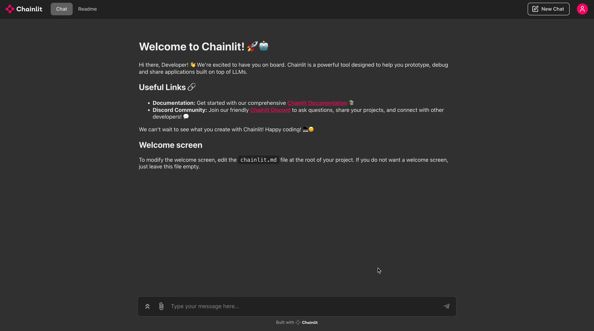

# MLX Server, Chainlit and Llama3 Chatbot in less than 2 minutes



## Installation

```bash
python3 -m venv venv
source venv/bin/activate
pip install -r requirements.txt
```

## Running Server

```bash
python -m mlx_lm.server --model mlx-community/Meta-Llama-3-8B-Instruct-4bit --log-level DEBUG
```

This will start the MLX server and will download the LLM if it is not already downloaded from Hugging Face.
Check this [link](https://www.mlxserver.com/) for more information about MLX.

## Running App

```bash
chainlit run app.py
```

This will start the Chainlit app. Check this [link](https://docs.chainlit.io/get-started/overview) for more information about ChainLit.
